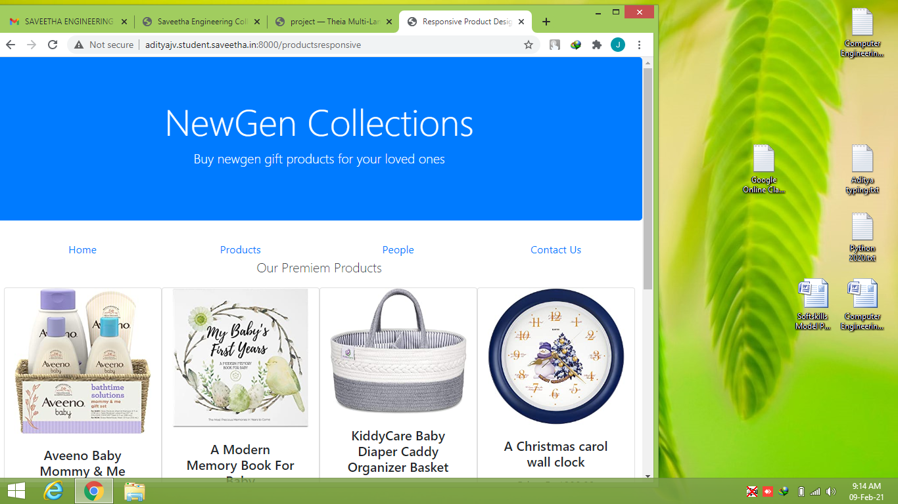
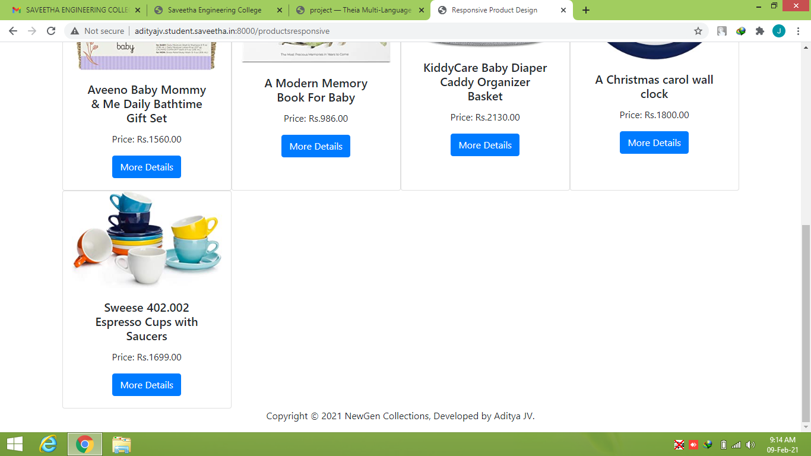

# Design of Responsive Website
## AIM:
To design a responsive website with two break points.

## DESIGN STEPS:
### Step 1: 
Requirement collection.
### Step 2:
Creating the layout using HTML and CSS.
### Step 3:
Updating the sample content.
### Step 4:
Choose the appropriate style and color scheme.
### Step 5:
Validate the layout in various browsers.
### Step 6:
Validate the HTML code.
### Step 7:
Create a database model and migrate the database.
### Step 8:
Retrieve data from database and display it in a dynamic webpage.
### Step 9:
Publish the website in the given URL.

## PROGRAM:

### productsresponsive.html
~~~
<!doctype html>
<html lang="en">
  <head>
    <!-- Required meta tags -->
    <meta charset="utf-8">
    <meta name="viewport" content="width=device-width, initial-scale=1, shrink-to-fit=no">

    <!-- Bootstrap CSS -->
    <link rel="stylesheet" href="https://cdn.jsdelivr.net/npm/bootstrap@4.6.0/dist/css/bootstrap.min.css" integrity="sha384-B0vP5xmATw1+K9KRQjQERJvTumQW0nPEzvF6L/Z6nronJ3oUOFUFpCjEUQouq2+l" crossorigin="anonymous">

    <title>Responsive Product Design</title>
  </head>
  <body>
    

        

            <h1 class="display-4">NewGen Collections</h1>
            
Buy newgen gift products for your loved ones

        

    

    

        

        
<a href="#">Home</a>

        
<a href="#">Products</a>

        
<a href="#">People</a>
 
        
<a href="#">Contact Us</a>
   
        

        

            

            
Our Premiem Products
    
            

        

    

        

        
        

            <h5 class="card-title">Aveeno Baby Mommy & Me Daily Bathtime Gift Set </h5>
            
Price: Rs.1560.00

            <a href="#" class="btn btn-primary">More Details</a>
        

        

        

        
        

            <h5 class="card-title">A Modern Memory Book For Baby </h5>
            
Price: Rs.986.00

            <a href="#" class="btn btn-primary">More Details</a>
        

        

        

        
        

            <h5 class="card-title">KiddyCare Baby Diaper Caddy Organizer Basket </h5>
            
Price: Rs.2130.00

            <a href="#" class="btn btn-primary">More Details</a>
        

        

        

        
        

            <h5 class="card-title">A Christmas carol wall clock </h5>
            
Price: Rs.1800.00

            <a href="#" class="btn btn-primary">More Details</a>
        

        

        

        
        

            <h5 class="card-title">Sweese 402.002 Espresso Cups with Saucers </h5>
            
Price: Rs.1699.00

            <a href="#" class="btn btn-primary">More Details</a>
        

        

    

    

        

            
Copyright © 2021 NewGen Collections, Developed by Aditya JV.

        

    

    

    <!-- Optional JavaScript; choose one of the two! -->

    <!-- Option 1: jQuery and Bootstrap Bundle (includes Popper) -->
    
    

    <!-- Option 2: Separate Popper and Bootstrap JS -->
    <!--
    
    
    
    -->
  </body>
</html>
~~~

## OUTPUT:

## RESULT:
Thus a website is designed for the newgen gift products in NewGen Collections and is hosted in the URL http://adityajv.student.saveetha.in:8000/productsresponsive. GitHub Repo URL is https://github.com/adityajv2310/responsivedesign.